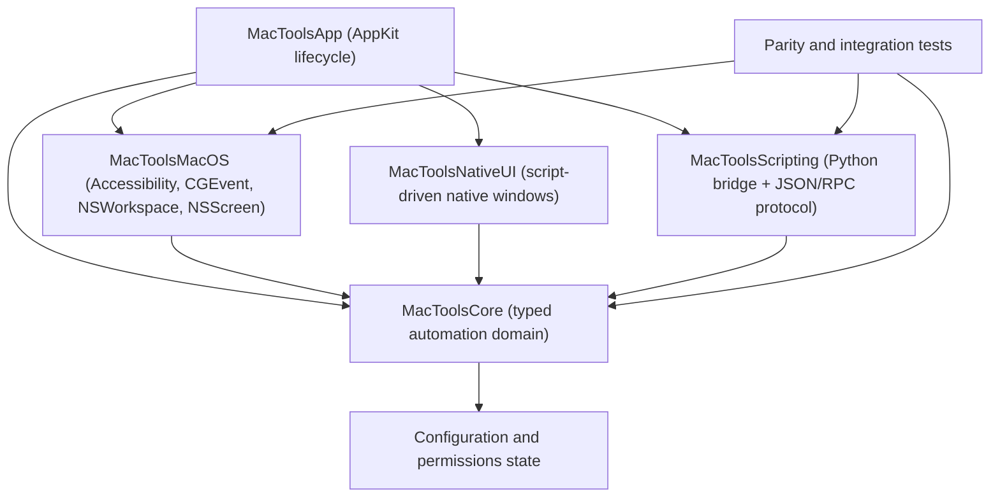

# TSMacTools Architecture Guide

## Goal

TSMacTools is a Swift rewrite of the core automation ideas from Hammerspoon. It keeps the useful macOS automation surface, including window management, hotkey capture, event taps, application/screen inspection, and script-driven UI, but replaces the Lua/Objective-C extension architecture with a Swift-first runtime and a Python-capable external scripting layer.

The local Hammerspoon reference checkout lives at `references/hammerspoon`. Treat it as read-only source material for behavior, API coverage, and parity tests.

## Reference Map

- `references/hammerspoon/Hammerspoon`: app lifecycle, preferences, console, accessibility helpers, AppleScript hooks, menu icon, app delegate, and launch behavior.
- `references/hammerspoon/LuaSkin`: Lua bridge design. Use this as a conceptual reference only; MacTools should expose a typed command protocol instead of embedding Lua as the primary runtime.
- `references/hammerspoon/extensions/window`: window discovery, focusing, moving, resizing, filtering, and screen relationships.
- `references/hammerspoon/extensions/eventtap`: keyboard/mouse event taps, hotkey foundations, and permission-sensitive event capture.
- `references/hammerspoon/extensions/hotkey` and `references/hammerspoon/extensions/keycodes`: key binding semantics and key-code mapping behavior.
- `references/hammerspoon/extensions/screen` and `references/hammerspoon/extensions/spaces`: display geometry, screen identifiers, and macOS Spaces behavior.
- `references/hammerspoon/extensions/webview`: script-controlled windows with dynamic content. MacTools will replace this with native AppKit/SwiftUI windows that can render text, Markdown, HTML-like content, and eventually custom Swift-native components.
- `references/hammerspoon/Hammerspoon Tests`: behavioral parity examples for modules that can be tested without manual permissions.
- `references/Mos`: read-only conceptual and behavioral reference for a compact preferences UI, mouse-wheel interception, display-synchronized smoothing, event-tap recovery, and scrolling regressions. Do not copy its runtime objects or treat its settings as a compatibility contract; local ownership and verification evidence live in `docs/parity/mos-scroll.md`.

## Proposed Architecture



### 1. Application Shell

The app shell owns process lifecycle, menu bar/dock behavior, settings, permission prompts, and crash-safe startup. It should stay thin and delegate automation behavior into core services.

Initial target:

- `Sources/MacToolsApp`
- `MacTools.xcodeproj` app target currently named `MacTools`, with the built app product and display name set to `TSMacTools`.
- AppKit `@main` entry point in `Sources/MacToolsApp/AppDelegate.swift`.
- Explicit Xcode links to `AppKit.framework` and `ApplicationServices.framework`.
- Xcode uses static library targets for `MacToolsCore`, `MacToolsMacOS`, and `MacToolsScripting` so the debug app bundle runs without embedded local framework signing issues.
- App startup bootstraps the user configuration directory at `~/.config/tsmactool`, creates `config.jsonc` when missing, and leaves existing user configuration untouched.
- The repository tracks `example_config/config.jsonc` and `example_config/scripts` as safe templates. Local development uses untracked `my_config`, with `~/.config/tsmactool` symlinked to that folder when needed.
- The app runs as a menu bar accessory via `LSUIElement`, does not occupy Dock space, automatically requests the standard Accessibility prompt on startup when needed, and exposes status-menu actions for controlling application menu bar icon visibility, reloading configuration, opening configuration, and quitting. On macOS 26 and later, the **Menu Bar Icons** submenu mirrors System Settings > Menu Bar > Allow in the Menu Bar. It enumerates and presses the real System Settings accessibility switches so Control Center applies its normal live animation without a process restart; entries resolve their native icons from installed application bundles, use standard menu-like pointer hover highlighting, show right-aligned checkmarks for enabled items, replace the checkmark area with a spinner while pending, and keep the submenu open for consecutive changes. It does not call entitlement-protected ControlCenter private APIs or read or rewrite the privacy-protected Control Center group container. Manual verification confirms row hover highlighting plus the displayed app icons and checkmarks, toggles at least two running applications without reopening the submenu, observes each pending spinner, confirms the menu stays visible plus the animations and matching state in System Settings, then restores the original states.
- The app icon lives in `Sources/MacToolsApp/Resources/Assets.xcassets/AppIcon.appiconset`.
- The status menu's **Settings...** item opens a native compact window with a Mos-informed top icon tab strip for General, Hotkeys, and Scrolling. The source reference informs the compact toolbar proportions, cached page-controller behavior, lightweight crossfade, and `NSTableView`-owned binding rows; the controls, state, and drawing remain TSMacTools-owned. Each tab centers its icon/title as one hit target, and each constructed page is cached until its data changes so ordinary tab switches do not rebuild the control tree. Hotkeys uses one compact non-selecting table with independently constructed cells, aligned columns, inset icon wells, and row separators; scroll tracking never paints persistent hover/selection backgrounds. General exposes common window-switcher, scripting, application, language, model/token, and masked provider-key fields; provider endpoints, prompts, and native-window details remain advanced JSONC fields with a direct file-opening action. Each save reloads the latest configuration and applies a coordinated field-level JSONC merge that preserves comments, order, unknown extension fields, and unrelated text-editor edits; when a typed hotkey action changes kind, existing fields owned by the previous kind are changed in place to `null`, so `decodeIfPresent` clears them without deleting nearby comments or unknown action extensions. External visible-field changes reconcile only after active editing/dragging is idle and retain the scroll position. The Hotkeys page owns add/delete, action selection, application/Python file selection, selected-application name/icon display, and recording for both keyboard combinations and mouse side buttons. Adding a row scrolls it into view and immediately focuses its trigger recorder. Changing an action first cancels any trigger or simulated-keystroke recorder, then replaces the row cell so the old target editor cannot survive the new action kind. `simulateKeystroke` actions can post combinations such as Control+Down; recording suspends the active Carbon and mouse registrations before installing the suppressing HID key-down tap, with session-level and local-monitor fallbacks, so the candidate cannot dispatch a previously bound action such as configuration reload. Keyboard triggers require at least one modifier; mouse triggers use zero-based Core Graphics button numbers and a session-level global Accessibility event tap with HID fallback. Recording rejects a trigger already assigned to another row against the latest on-disk configuration without writing or ending capture, and resumes the latest complete set on success, Escape, focus loss, page change, refresh, or close. Modifier aliases, ordering, repetition, key case, and identical mouse buttons do not bypass duplicate detection. The Scrolling page exposes local presets, per-axis smoothing/reversal, trackpad bypass, and all bounded tuning controls including `deadZone`. Debug builds expose `--render-settings-previews <directory>` to render every page in light and dark appearance plus compact 760 x 540 Hotkeys/Scrolling variants, asserting that the owned page/stack/document layout is unambiguous without Screen Recording permission.
- Mouse triggers retain Command/Control/Option/Shift held during recording and display the full chord. Runtime suppression, dispatch, and duplicate detection match the canonical modifier-plus-button trigger exactly, so plain Mouse 6 and Command+Mouse 6 may coexist while aliases and modifier order cannot create duplicates.
- Keyboard recording, Carbon registration, duplicate detection, and simulated keystrokes resolve through the single typed `HotkeyKey` virtual-key model. It covers ANSI letters, number row, punctuation, F1...F20, editing/navigation, keypad, ISO, and JIS keys; any otherwise unknown captured key-down code persists as `KeyCode:<number>` instead of being rejected by a UI whitelist. Modifier-only keys remain modifiers rather than primary trigger keys, and Escape continues to cancel recording.
- Later: entitlements, launch-at-login, and a stable release signing identity.

### 2. Core Automation Domain

`MacToolsCore` defines stable Swift models and service protocols:

- `WindowManaging`
- `HotkeyCapturing`
- `SystemEventObserving`
- `AutomationRuntime`
- typed command models such as `AutomationCommand`, `NativeWindowContent`, `UserConfiguration`, hotkey bindings, window switcher settings, translation settings, and window identifiers.

This module should not import AppKit-specific UI code unless the model requires macOS value types. Prefer plain Swift structs, protocols, and testable reducers.

### 3. macOS Capability Layer

`MacToolsMacOS` is the concrete, independently testable macOS capability module. Its first production owner is smooth scrolling:

- `SmoothScrollController` composes injected event-tap, display-frame, scheduler, permission, source-classification, target-PID, target-bypass, and event-posting adapters. The App target imports this controller through a thin typealias rather than duplicating runtime logic.
- The live scroll adapters own `CGEventTap`, run-loop-source, and `CVDisplayLink` handles. CoreVideo output callbacks only mark current-run readiness and coalesce timestamps onto a serial delivery queue; they never synchronously enter controller code that can hold the operation lock while calling `CVDisplayLinkStop`. Display-run generations discard queued callbacks after stop/restart, controller frame delivery remains serialized, terminal sessions clear routing, background teardown is idempotent, and token registries make callbacks harmless after invalidation. Mechanical line-unit input is normalized to one reusable pixel-unit synthetic template per physical event; original line distance is accumulated and emitted once on the next frame instead of once per animation frame, so both point-oriented and line-oriented consumers receive usable output without multiplying a notch across the tail. The first input remains raw until the current display-link run has delivered a real callback; create/start success and a callback from an earlier run are not treated as proof that synthetic frames can be posted. Idle stop clears readiness while retaining the reusable `CVDisplayLink` handle. Remote continuous input bypasses local smoothing through a TSMacTools-owned normalized bundle/executable identity-fragment classifier, Logitech Options wheel input overrides trackpad-like scroll-count metadata, and the one-process classification cache is dropped when its application terminates so PID reuse cannot retain stale behavior. Legacy Dock targets can bypass on pre-macOS 26 systems, and mouse-down cancels a pending tail. Fakes exercise the same controller in non-hosted tests without Accessibility permission.
- Future Accessibility API wrappers for window/application inspection.
- Additional `CGEventTap` wrappers for keyboard and mouse capture.
- `NSScreen` and CoreGraphics display geometry.
- `NSWorkspace` application lifecycle observation.
- Permission status detection for Accessibility, Input Monitoring, Screen Recording, and Automation.

The wrappers should normalize system errors into typed Swift errors. Any permission-sensitive call should have a dry-run/status path so tests and UI can explain what is missing.

Initial permission handling lives in `MacToolsCore.SystemPermissions`:

- `AccessibilityPermissionClient.snapshot()` checks `AXIsProcessTrusted()`.
- `AccessibilityPermissionClient.requestAccessibilityPrompt()` calls `AXIsProcessTrustedWithOptions` with the system prompt option.
- App startup requests the standard macOS Accessibility prompt when permission is missing and does not show an additional native permissions window.
- `TSMacTools --check-accessibility` prints the built app's own Accessibility status and exits without opening the UI.
- On macOS 26 and later, `TSMacTools --list-menu-bar-applications` opens the Menu Bar settings pane without activation, prints the application visibility controls discoverable through Accessibility, and exits.
- Debug builds are configured to match this checkout's Xcode local-run identity: Automatically manage signing enabled, Team `426R374L39`, and Signing Certificate `Apple Development`. Build through the project without a command-line signing override; changing the team, certificate, bundle identifier, or app path can make macOS TCC ask for Accessibility permission again.
- Unit tests must inject fake permission checkers and must not require real macOS permissions.

Next permission stages:

- Input Monitoring: required for global keyboard event capture where Accessibility alone is insufficient.
- Screen Recording: required for screen/window image capture or OCR-like workflows.
- Automation: required when sending Apple Events to other applications.

### 4. Native Script-Driven Windows

Hammerspoon's `hs.webview` is the behavior reference, but MacTools should expose a native window system instead of a browser-first API.

Minimum content contract:

```json
{
  "command": "window.show",
  "id": "status",
  "title": "Status",
  "format": "markdown",
  "body": "# Ready"
}
```

Planned rendering levels:

- `plainText`: AppKit text view.
- `markdown`: parsed attributed text.
- `html`: sanitized display path, initially text fallback, later optional `WKWebView` only when web compatibility is explicitly needed.
- `native`: future structured JSON describing Swift-native components such as lists, buttons, tables, forms, logs, and progress views.

### 5. Scripting Layer

Python is the first external scripting language. The app should communicate with scripts through a versioned protocol rather than direct in-process embedding.

Recommended stages:

1. One JSON command per stdout line for local scripts.
2. Request/response IDs and async events.
3. Capability discovery so scripts can ask which native APIs are available.
4. Optional local socket transport for long-running script modules.
5. Sandboxing and trust policy for user-installed scripts.

The current prototype has `PythonScriptBridge.decodeCommand(from:)` for the first JSON command contract. User scripts are launched with the configured `scripting.pythonPath`; the app injects `config`, `input_text`, `nativewindow`, and `window` globals into the script module, then calls the function named by the hotkey action.

## Migration Plan From Hammerspoon

1. Inventory Hammerspoon modules and mark each as `core`, `native-ui`, `scripting`, `later`, or `out-of-scope`.
2. Rebuild the minimal runtime: app shell, command protocol, native window display, logging, configuration load/reload.
3. Rebuild hotkeys: keycode map, modifiers, registration, conflict reporting, callback dispatch.
4. Rebuild event taps: keyboard/mouse capture, permission detection, event filtering, event synthesis policy.
5. Rebuild windows/screens: enumerate windows, move/resize/focus, screen geometry, app associations.
6. Add application observers: launch/terminate/activate/deactivate, bundle IDs, app lookup.
7. Add parity tests using Hammerspoon tests and module docs as behavior references.
8. Add permission-gated integration tests that can be skipped until the user grants macOS permissions.

Current migrated user configuration:

- `~/.config/tsmactool/config.jsonc` stores the Hammerspoon-derived bundle IDs, Python executable path, app focus hotkeys, Finder/terminal toggles, reload binding, window switcher preferences, and translation settings as one JSONC object with `//` and `/* */` comments allowed. The Finder toggle focuses the most recent Finder window when another app is frontmost; when Finder is already frontmost, it raises an existing Home folder window or creates a new Home window if the current Finder window is already Home. `translation.provider` selects `"google_web"`, `"google"`, or `"llm"`. `google_web` uses the unofficial `translate.googleapis.com/translate_a/single` endpoint with no API key; it is convenient for local personal use but has no official stability, quota, or compatibility guarantees and may be rate-limited. `google` uses Google Cloud Translation Basic v2 with `translation.googleApiKey`. Provider-owned endpoints and clients are built into the script defaults; config only needs them when intentionally overriding a provider. Google modes use auto source detection, `translation.googleTargetLanguage` for non-Chinese text (`zh-CN` by default), and `translation.googleTargetLanguageForChinese` for Chinese text (`en` by default). `translation.normalizePDFLineBreaks` defaults to `true`, joining common PDF hard-wrapped lines before translation while preserving blank paragraphs and structural lines such as lists. The LLM mode defaults to `qwen/qwen3.6-27b`; `translation.contextWindowTokens` defaults to `262144`, `translation.outputTokenLimit` defaults to `2048`, and `translation.requestTokenLimit` defaults to `8000` for Groq on-demand request budgeting. The effective LLM output budget is sent as `max_completion_tokens` so reasoning models have enough budget to produce final text after hidden reasoning. The translation script estimates prompt tokens before each LLM request; if the selected text plus output budget exceeds the configured context window, the translation window shows a budget warning instead of sending the request. If the selected text plus output budget exceeds `requestTokenLimit`, the script clamps `max_completion_tokens` before sending to avoid service-tier TPM request-size failures. HTTP error responses from providers are decoded and shown in the translation window instead of a generic status line. `translation.thinkingEnabled` defaults to `false`; `translation.thinkingParameter` defaults to `"include_reasoning"` for the Groq-backed CLIProxyAPI path, which sends `include_reasoning: false` to hide reasoning output while the upstream may still consume reasoning tokens. Other supported values are `"reasoning_format"`, `"enable_thinking"`, and `"none"`. The translation script logs compact stderr summaries; the app includes them in `[hotkey]` logs when `windowSwitcher.debug` is enabled. The native translation window renders Markdown, keeps text selectable for copying, and folds returned `<think>...</think>` blocks behind a Show Thinking button. Short status messages such as reload success are shown in separate transient alert panels instead of reusing the script content window. Derived fields such as `version`, hotkey `id`, `application.name`, and `application.configDirectoryName` are intentionally omitted from defaults.
- `scroll` controls mouse-wheel smoothing. It defaults to enabled with the local `balanced` preset, vertical and horizontal smoothing on, reversal off, and phase- or scroll-count-bearing trackpad/Magic Mouse gestures excluded. Logitech Options source metadata overrides its trackpad-like scroll count, already-continuous remote-desktop input stays native, and other third-party drivers require the hardware check documented in `docs/parity/mos-scroll.md`. `precise`, `balanced`, `fluid`, and `glide` select bounded local curves; `custom` preserves explicit `tuning.step`, `speed`, `duration`, `acceleration`, and `deadZone`. These are TSMacTools presets, not Mos or Smooze Pro compatibility claims. `MacToolsCore.SmoothScrollEngine` emits complete tracking begin/change/end and momentum begin/change/end sequences and ends old momentum before a new tracking gesture. `SmoothScrollSession` owns deterministic generation/TTL/PID state and clears routing at terminal idle. `MacToolsMacOS.SmoothScrollController` reuses its event tap and display driver across configuration reloads, serializes controller frame delivery, converts mechanical line-unit input to a reusable pixel-unit template while emitting each physical input's accumulated line distance only once, routes marked synthetic frames through the session tap on macOS 26 so WindowServer can deliver them by the copied physical location, and retains direct-to-PID delivery on older systems. The live driver moves coalesced CoreVideo timestamps onto a serial queue before controller work, preventing synchronous display-link stop from waiting on the controller operation lock; a display-run generation rejects queued work from earlier runs. It cancels tails on mouse-down, coalesces enabled screen-change rebuilds, and leaves the original field-preserving event in the system path until display-link creation, start, and a callback from the current run have all succeeded. Idle stop clears run readiness without rebuilding the prepared display-link handle. Debug builds emit bounded `[smooth-scroll]` input-disposition and synthetic-frame routing diagnostics. It tears down its observer, run-loop source, tap, timers, and display link on shutdown or background deinitialization. App-level reloads retain all three controllers; only changed hotkey arrays are re-registered, and enabled window-switcher configuration updates do not recreate its CGEvent tap. The App delegate explicitly shuts down the main-actor Carbon hotkey handler before termination instead of deferring Carbon cleanup to Swift's nonisolated deinitializer. Event-tap recovery rechecks Accessibility and is limited to three attempts per minute.
- `windowSwitcher.followFocusedScreen` centers the overlay on the display with the largest intersection with the selected Accessibility window. `windowSwitcher.restorePreviousApplicationWhenNoWindows` defaults to `true` and is exposed in General settings; when disabled, window-destroy notifications do not start the repeated no-window confirmation or restore the most recent previous application. Width is guarded to at least 320 points and height to at least 120 at runtime; Settings accepts width 320...1600, height 120...1200, and 1...50 visible rows. `commandTabBehavior` and `sameApplicationBehavior` preserve the migrated current strategy identifiers, but no alternate runtime strategies exist yet, so Settings presents them as read-only rather than accepting ineffective edits.
- `translation.enabled` gates the typed translation action, `callInterface("translateSelection")`, and the shipped selected-text `scripts/translate_selection.py` hotkey path.
- `example_config/config.jsonc` mirrors the supported config shape with comments and no real secrets. `my_config/config.jsonc` is the local, untracked runtime copy and may contain real API keys.
- `Sources/MacToolsApp/GlobalHotkeyController.swift` registers keyboard triggers with Carbon `RegisterEventHotKey`, owns one reusable session-level `otherMouseDown` event tap with an HID creation fallback for configured mouse-button triggers, and dispatches app focus, app toggle, simulated keystrokes, config reload, focused app info, selected-text translation, interfaces, and scripts. Keyboard registration replacement is all-or-nothing: partial staged refs are removed on failure and the prior complete set is restored when possible. The mouse tap suppresses only configured buttons, re-enables after timeout disables, and remains disabled after a user-input/permission disable until normal controller reconfiguration. Reconfiguration verifies both the tap Mach port and enabled state; a dead tap is invalidated and recreated instead of being reported as active. Settings recording owns a unique capture token that unregisters active keyboard shortcuts, disables the mouse tap, blocks queued callbacks, stages configuration changes without re-registering, rejects stale completion callbacks, and resumes the latest configuration only when capture ends. `simulateKeystroke` posts one HID key-down/key-up pair, applies configured modifiers to key-down, restores `maskSecondaryFn` for arrow keys to match physical events and `AppleSymbolicHotKeys`, and normally clears flags on key-up; Command+Tab retains Command on key-up because the macOS app switcher requires it. Script actions use `runScript`, `path`, `function`, optional `input`, and optional `nativeWindowID`; stdout/stderr are drained asynchronously so a verbose script cannot block on a full pipe, and `windowSwitcher.debug` enables `[hotkey]` timing logs for action dispatch, selected-text copy, and script execution.
- Window-switcher AX window matching fetches role, subrole, title, geometry, and state in one batch per uncached window rather than issuing a sequence of synchronous attribute requests. Debug logging is lazy, uses unified logging, and reuses the same batched snapshot so diagnostics do not add repeated Excel AX round trips to the selection or focus critical path.
- Synthetic-key intrinsic flags are owned by the typed `HotkeyAction.implicitCGEventModifiers` key-semantics table rather than scattered executor checks. Arrow keys currently contribute secondary Function; future special keys must add physical-event flags through the same table and corresponding permission-independent tests.
- `Sources/MacToolsApp/WindowSwitcherController.swift` installs a CGEvent tap when `windowSwitcher.enabled` is true, suppresses handled `Command+Tab` and `Command+\`` key events, and briefly defers the preceding Command-down transition. The tap runs on a dedicated user-interactive run loop so synchronous Office Accessibility work on the main thread cannot trigger a tap timeout and leak native switcher events. A quick switcher chord suppresses the matching Command transitions as one unit so applications with bare-Command listeners do not react; any ordinary Command shortcut immediately replays the deferred modifier before its key event, and an expired deferral passes later events normally. Tap-thread key and modifier events enter one ordered coalescing queue; when the main thread recovers from a busy application, it drains the accumulated batch without visually replaying each delayed selection after Command was released. The controller cycles the selected Accessibility window in the background, delays the native AppKit overlay briefly while Command is held, de-duplicates candidates by Accessibility window identity, filters fake windows by CG/AX properties instead of title text, observes AX lifecycle notifications, removes destroyed windows, and restores the previous application only after repeated checks confirm that the frontmost app has no substantial Accessibility windows. Startup enables the event tap without scheduling AX prewarming, and first use does not bulk-register observers for every running application; observers are installed on application launch/activation or selection so Command+Tab is ready immediately after app launch. Finder/Dock activation schedules bounded 50/180/450 ms recency captures for the expected PID, prefers the AX main window with focused-window fallback, discards stale generations after another activation, listens for both main- and focused-window changes, retries transient AX notification-registration failures, and promotes the current frontmost CG window while constructing candidates so a missed Office event cannot preserve stale ordering. The switcher's own current-row detection in `buildChoices` also prefers the frontmost application's live `kAXFocusedWindow` (then `kAXMainWindow`) over the top-most same-PID CG window, because an unfocused auxiliary window can sit above the real key window in CG z-order; without that, same-app cycling listed the actual current window at index 1 and selecting it re-focused the visible window with no apparent change. Debug builds log a `choices current-window corrected` line when the focused-window identity differs from the CG z-order first match. Main/focused-window fallback uses explicit short-circuit AX reads rather than a lazy compact-map collection, avoiding Swift runtime assertions during repeated activation and AX notifications. AX window lists are fetched once per process per switch operation; the normal 80 ms timeout gets one bounded 300 ms retry after `kAXErrorCannotComplete`, then falls back to that application's focused AX window if the list remains unavailable. This avoids repeated full-list reads and keeps temporarily busy applications such as Microsoft Excel in the candidate set. Failed AX reads are indeterminate rather than proof of zero windows, nonstandard main-window subroles still prevent restoration, and a newly focused substantial window cancels restoration so closing transient panels such as WeChat's emoji picker cannot switch applications. The controller moves hidden applications or minimized windows behind active windows and focuses the selected Accessibility window when Command is released. Focus is AX-only: it clears the selected window's minimized AX attribute, sets the system `kAXFocusedApplicationAttribute` and application `kAXFrontmostAttribute` for cross-app switches, performs `kAXRaiseAction` on only that selected AX window, sets the window's `kAXMainAttribute` and `kAXFocusedAttribute`, sets the owning application's `kAXFocusedWindowAttribute` to the selected window, and verifies the result through an app-level AXObserver listening for `kAXFocusedWindowChangedNotification`. Every focus attempt owns a generation; a newer switch or shutdown invalidates all delayed retry and Finder workaround tasks, including when rapid cycling returns to the same Office window key. Finder also uses Hammerspoon's delayed AX main-window retry. The focus path avoids AppKit app-wide activation, Carbon front-process calls, synthetic mouse events, and pointer movement. `windowSwitcher.debug` logs CG/AX attributes, lifecycle notifications, AX focus verification, focus retries, and timing lines for `step`, `buildChoices`, slow AX reads, and hotkey/script execution. Manual Excel verification launches or reactivates Word/Excel through Finder and the Dock, opens several workbooks, repeatedly switches away and back while Excel recalculates or shows a sheet dialog, checks that the visible front Office window is first in recency and remains focusable, and confirms that debug logs contain at most one `AX windows retry` line for Excel per switch operation.
- `windowSwitcher.displayDelay` defaults to 0.15 seconds and is editable in General settings from 0...2 seconds. After `Command+Tab` makes the delayed overlay visible, holding Shift while Command remains down moves the selection upward immediately and then repeats with `NSEvent.keyRepeatDelay` and `NSEvent.keyRepeatInterval`, matching held-Tab downward speed. Shift does not move the selection before the overlay appears, repeat work is cancelled when either modifier is released or the overlay closes, and focus is still committed only when Command is released.
- `Sources/MacToolsApp/AppDelegate.swift` shows translation `window.show` commands as floating native windows that appear immediately with a spinning `Translating...` state while the script is running, use dynamic system colors for light/dark mode, close when focus is lost by default, and include a title-bar pin button so the same window can stay visible and receive later translation updates.
- `~/.config/tsmactool/scripts/translate_selection.py` is the user-facing translation script. It receives `config`, `input_text`, and `nativewindow` as injected globals, normalizes common PDF hard-wrapped selected text when enabled, calls the configured translation provider, and shows a native Markdown window instead of using `hs.webview`.
- The repository template at `example_config/scripts/translate_selection.py` should not contain a real API key.

Window-switcher candidate construction reuses a recent AX window only when its current on-screen `CGWindowID` matches (with bounded title/bounds fallback for legacy cache entries), so known visible windows do not repeat full `kAXWindows` enumeration on every switch. A transient AX timeout while checking a cached window is indeterminate rather than proof that the window was destroyed; indeterminate windows retain their recency, while invalid AX elements and terminated processes are removed. A successful activation capture completes that activation generation so the later 180/450 ms retries do not repeat observer and attribute work.

## Testing Strategy

Build, test, and run through the Xcode project. Do not use `swift test` or `swift run` for normal validation, because they do not exercise the same app target, signing, bundle, and runtime wiring as Xcode:

```sh
xcodebuild -project MacTools.xcodeproj -scheme MacTools -configuration Debug -derivedDataPath DerivedData build
xcodebuild -project MacTools.xcodeproj -scheme MacTools -configuration Debug -derivedDataPath DerivedData test
open DerivedData/Build/Products/Debug/TSMacTools.app
```

`DerivedData`, `DerivedDataCore`, `.build`, and `build` are ignored local output directories and must not be committed.

Check the built app's own Accessibility state:

```sh
DerivedData/Build/Products/Debug/TSMacTools.app/Contents/MacOS/TSMacTools --check-accessibility
```

Render the real Debug settings pages for permission-independent visual QA:

```sh
DerivedData/Build/Products/Debug/TSMacTools.app/Contents/MacOS/TSMacTools --render-settings-previews DerivedData/SettingsPreviews
```

Run the narrow provenance guard after changing the Mos-informed settings or scrolling implementation. It rejects exact normalized blocks of four or more consecutive source lines shared with the read-only reference; it is a regression aid, not a general similarity or legal analysis:

```sh
~/.venv/bin/python Tools/check_mos_provenance.py
```

The built app's Accessibility check is path/signature sensitive because macOS TCC tracks the app identity. Do not use a separate `swift` script to infer the app's permission state; that only checks the `swift` process.

Script examples live under `example_config/scripts`; they are designed to run through the app's injected globals rather than as standalone commands.

Future test layers:

- Unit tests for command decoding, key mapping, geometry transforms, and runtime routing.
- Unit tests for permission state handling with fake permission clients.
- Snapshot tests for native window content models.
- Permission-independent macOS wrapper tests with fake adapters.
- Permission-gated integration tests for Accessibility and event taps.
- Parity checklist against `references/hammerspoon/Hammerspoon Tests`.
- Mos scrolling parity and permission/device verification checklist in `docs/parity/mos-scroll.md`; fake-adapter and live-driver tests cover exact phase transitions and interruption, prepare/start/unavailable fallback, nonblocking display stop with stalled controller frame work, recovery limiting, screen debounce/disabled suppression, concurrent and late callbacks, background teardown, PID switching/idle clearing, generation/TTL, source classification, mixed-axis fields, recursion prevention, legacy Dock bypass, and mouse-down cancellation. Real Accessibility/TCC transitions, physical device classification, display hot-plug behavior, third-party application delivery, and Instruments handle/latency measurements remain manual release checks.

## Documentation Responsibilities

- `README.md` is the public product page. Keep it concise, inviting, and user-oriented: explain what TSMacTools does, why it is useful, its main workflows, screenshots, installation and first-run steps, user-visible permissions, basic configuration entry points, compatibility, and release status.
- `AGENTS.md` is the canonical engineering guide. Keep architecture, source ownership, runtime and protocol details, implementation invariants, signing and TCC behavior, build and test commands, manual verification, migration notes, parity evidence, and reference-checkout guidance here rather than in `README.md`.
- Do not duplicate detailed technical descriptions across both files. When technical material is found in `README.md`, merge any enduring engineering constraint or verification requirement into the appropriate `AGENTS.md` section, then remove the implementation detail from the README.
- Update `README.md` only when a change affects the user-visible feature set, setup, compatibility, required permissions, basic configuration entry points, screenshots, or release status. Update `AGENTS.md` when architecture, implementation behavior, build settings, scripting protocols, tests, verification, or developer workflows change. Update both only when a change genuinely affects both audiences; ordinary code changes do not require README churn.

## Engineering Rules

- Any config field, script entrypoint, or user-facing automation behavior change must also update tracked `example_config/config.jsonc` and relevant files under `example_config/scripts`.
- Keep `references/hammerspoon` read-only.
- Keep `references/Mos` read-only; use it as behavioral source material, not as code to transplant.
- Prefer Swift typed models and protocols over dynamic dictionaries inside the app.
- Keep Python at the boundary. It can provide powerful processing, but it should talk to the app through explicit commands/events.
- Every Hammerspoon capability we rebuild should get a local parity note, a Swift owner module, and at least one test or documented manual verification path.
- Do not depend on runtime macOS permissions for ordinary unit tests.
