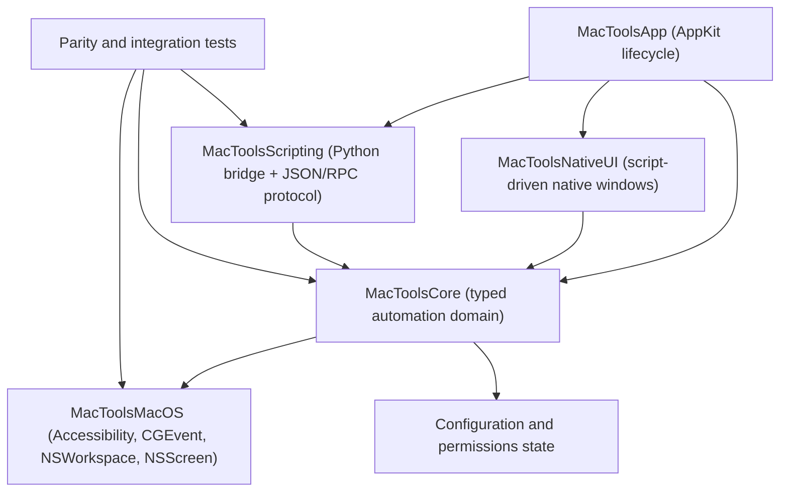

# TSMacTools Architecture Guide

## Goal

TSMacTools is a Swift rewrite of the core automation ideas from Hammerspoon. It keeps the useful macOS automation surface, including window management, hotkey capture, event taps, application/screen inspection, and script-driven UI, but replaces the Lua/Objective-C extension architecture with a Swift-first runtime and a Python-capable external scripting layer.

The local Hammerspoon reference checkout lives at `references/hammerspoon`. Treat it as read-only source material for behavior, API coverage, and parity tests.

## Reference Map

- `references/hammerspoon/Hammerspoon`: app lifecycle, preferences, console, accessibility helpers, AppleScript hooks, menu icon, app delegate, and launch behavior.
- `references/hammerspoon/LuaSkin`: Lua bridge design. Use this as a conceptual reference only; MacTools should expose a typed command protocol instead of embedding Lua as the primary runtime.
- `references/hammerspoon/extensions/window`: window discovery, focusing, moving, resizing, filtering, and screen relationships.
- `references/hammerspoon/extensions/eventtap`: keyboard/mouse event taps, hotkey foundations, and permission-sensitive event capture.
- `references/hammerspoon/extensions/hotkey` and `references/hammerspoon/extensions/keycodes`: key binding semantics and key-code mapping behavior.
- `references/hammerspoon/extensions/screen` and `references/hammerspoon/extensions/spaces`: display geometry, screen identifiers, and macOS Spaces behavior.
- `references/hammerspoon/extensions/webview`: script-controlled windows with dynamic content. MacTools will replace this with native AppKit/SwiftUI windows that can render text, Markdown, HTML-like content, and eventually custom Swift-native components.
- `references/hammerspoon/Hammerspoon Tests`: behavioral parity examples for modules that can be tested without manual permissions.

## Proposed Architecture



### 1. Application Shell

The app shell owns process lifecycle, menu bar/dock behavior, settings, permission prompts, and crash-safe startup. It should stay thin and delegate automation behavior into core services.

Initial target:

- `Sources/MacToolsApp`
- `MacTools.xcodeproj` app target currently named `MacTools`, with the built app product and display name set to `TSMacTools`.
- AppKit `@main` entry point in `Sources/MacToolsApp/AppDelegate.swift`.
- Explicit Xcode links to `AppKit.framework` and `ApplicationServices.framework`.
- Xcode uses static library targets for `MacToolsCore` and `MacToolsScripting` so the debug app bundle runs without embedded local framework signing issues.
- App startup bootstraps the user configuration directory at `~/.config/tsmactool`, creates `config.jsonc` when missing, and leaves existing user configuration untouched.
- The repository tracks `example_config/config.jsonc` and `example_config/scripts` as safe templates. Local development uses untracked `my_config`, with `~/.config/tsmactool` symlinked to that folder when needed.
- The app runs as a menu bar accessory via `LSUIElement`, does not occupy Dock space, and exposes minimal status-menu actions for permission prompting, opening configuration, and quitting.
- The app icon lives in `Sources/MacToolsApp/Resources/Assets.xcassets/AppIcon.appiconset`.
- Later: entitlements, launch-at-login, menu bar UI, settings window, and a stable development signing identity.

### 2. Core Automation Domain

`MacToolsCore` defines stable Swift models and service protocols:

- `WindowManaging`
- `HotkeyCapturing`
- `SystemEventObserving`
- `AutomationRuntime`
- typed command models such as `AutomationCommand`, `NativeWindowContent`, `UserConfiguration`, hotkey bindings, window switcher settings, translation settings, and window identifiers.

This module should not import AppKit-specific UI code unless the model requires macOS value types. Prefer plain Swift structs, protocols, and testable reducers.

### 3. macOS Capability Layer

Create a future `MacToolsMacOS` module for concrete implementations:

- Accessibility API wrappers for window/application inspection.
- `CGEventTap` wrappers for keyboard and mouse capture.
- `NSScreen` and CoreGraphics display geometry.
- `NSWorkspace` application lifecycle observation.
- Permission status detection for Accessibility, Input Monitoring, Screen Recording, and Automation.

The wrappers should normalize system errors into typed Swift errors. Any permission-sensitive call should have a dry-run/status path so tests and UI can explain what is missing.

Initial permission handling lives in `MacToolsCore.SystemPermissions`:

- `AccessibilityPermissionClient.snapshot()` checks `AXIsProcessTrusted()`.
- `AccessibilityPermissionClient.requestAccessibilityPrompt()` calls `AXIsProcessTrustedWithOptions` with the system prompt option.
- App startup requests the standard macOS Accessibility prompt when permission is missing and does not show an additional native permissions window.
- `TSMacTools --check-accessibility` prints the built app's own Accessibility status and exits without opening the UI.
- Debug builds are configured to match Xcode's local run signing: Automatically manage signing enabled, Team set to None, and Signing Certificate set to `Sign to Run Locally`. Do not override the project with a different command-line signing identity, because changing the signing identity can make macOS TCC ask for Accessibility permission again.
- Unit tests must inject fake permission checkers and must not require real macOS permissions.

Next permission stages:

- Input Monitoring: required for global keyboard event capture where Accessibility alone is insufficient.
- Screen Recording: required for screen/window image capture or OCR-like workflows.
- Automation: required when sending Apple Events to other applications.

### 4. Native Script-Driven Windows

Hammerspoon's `hs.webview` is the behavior reference, but MacTools should expose a native window system instead of a browser-first API.

Minimum content contract:

```json
{
  "command": "window.show",
  "id": "status",
  "title": "Status",
  "format": "markdown",
  "body": "# Ready"
}
```

Planned rendering levels:

- `plainText`: AppKit text view.
- `markdown`: parsed attributed text.
- `html`: sanitized display path, initially text fallback, later optional `WKWebView` only when web compatibility is explicitly needed.
- `native`: future structured JSON describing Swift-native components such as lists, buttons, tables, forms, logs, and progress views.

### 5. Scripting Layer

Python is the first external scripting language. The app should communicate with scripts through a versioned protocol rather than direct in-process embedding.

Recommended stages:

1. One JSON command per stdout line for local scripts.
2. Request/response IDs and async events.
3. Capability discovery so scripts can ask which native APIs are available.
4. Optional local socket transport for long-running script modules.
5. Sandboxing and trust policy for user-installed scripts.

The current prototype has `PythonScriptBridge.decodeCommand(from:)` for the first JSON command contract. User scripts are launched with the configured `scripting.pythonPath`; the app injects `config`, `input_text`, `nativewindow`, and `window` globals into the script module, then calls the function named by the hotkey action.

## Migration Plan From Hammerspoon

1. Inventory Hammerspoon modules and mark each as `core`, `native-ui`, `scripting`, `later`, or `out-of-scope`.
2. Rebuild the minimal runtime: app shell, command protocol, native window display, logging, configuration load/reload.
3. Rebuild hotkeys: keycode map, modifiers, registration, conflict reporting, callback dispatch.
4. Rebuild event taps: keyboard/mouse capture, permission detection, event filtering, event synthesis policy.
5. Rebuild windows/screens: enumerate windows, move/resize/focus, screen geometry, app associations.
6. Add application observers: launch/terminate/activate/deactivate, bundle IDs, app lookup.
7. Add parity tests using Hammerspoon tests and module docs as behavior references.
8. Add permission-gated integration tests that can be skipped until the user grants macOS permissions.

Current migrated user configuration:

- `~/.config/tsmactool/config.jsonc` stores the Hammerspoon-derived bundle IDs, Python executable path, app focus hotkeys, Finder/terminal toggles, reload binding, window switcher preferences, and LLM translation settings as one JSONC object with `//` and `/* */` comments allowed. Derived fields such as `version`, hotkey `id`, `application.name`, and `application.configDirectoryName` are intentionally omitted from defaults.
- `example_config/config.jsonc` mirrors the supported config shape with comments and no real secrets. `my_config/config.jsonc` is the local, untracked runtime copy and may contain real API keys.
- `Sources/MacToolsApp/GlobalHotkeyController.swift` currently registers configured hotkeys with Carbon `RegisterEventHotKey` and dispatches app focus, app toggle, config reload, focused app info, and selected-text translation actions. Actions can either call built-in Swift interfaces via `callInterface` and `interfaceName`, or run a configured Python file via `runScript`, `path`, `function`, optional `input`, and optional `nativeWindowID`.
- `Sources/MacToolsApp/WindowSwitcherController.swift` installs a CGEvent tap when `windowSwitcher.enabled` is true, suppresses `Command+Tab` and `Command+\``, displays a native AppKit overlay, de-duplicates candidates by Accessibility window identity, filters fake windows by CG/AX properties instead of title text, observes AX lifecycle notifications, removes destroyed windows, moves hidden or minimized windows behind active windows, and focuses the selected Accessibility window when Command is released. Focus mirrors Hammerspoon by making the AX window main, bringing the app frontmost via the Carbon process API, and raising the AX window. `windowSwitcher.debug` logs CG/AX attributes, lifecycle notifications, and focus retries.
- `Sources/MacToolsApp/AppDelegate.swift` shows translation `window.show` commands as floating native windows that appear immediately with a spinning `Translating...` state while the script is running, use dynamic system colors for light/dark mode, close when focus is lost by default, and include a title-bar pin button so the same window can stay visible and receive later translation updates.
- `~/.config/tsmactool/scripts/translate_selection.py` is the user-facing translation script. It receives `config`, `input_text`, and `nativewindow` as injected globals, calls a chat-completions-compatible endpoint, and shows a native Markdown window instead of using `hs.webview`.
- The repository template at `example_config/scripts/translate_selection.py` should not contain a real API key.

## Testing Strategy

Run fast checks:

```sh
swift test
```

Run the app locally:

```sh
swift run MacTools
```

Build, test, and run the Xcode app target:

```sh
xcodebuild -project MacTools.xcodeproj -scheme MacTools -configuration Debug -derivedDataPath DerivedData build
xcodebuild -project MacTools.xcodeproj -scheme MacTools -configuration Debug -derivedDataPath DerivedData test
open DerivedData/Build/Products/Debug/TSMacTools.app
```

Check the built app's own Accessibility state:

```sh
DerivedData/Build/Products/Debug/TSMacTools.app/Contents/MacOS/TSMacTools --check-accessibility
```

This check is path/signature sensitive because macOS TCC tracks the app identity. Do not use a separate `swift` script to infer the app's permission state; that only checks the `swift` process.

Script examples live under `example_config/scripts`; they are designed to run through the app's injected globals rather than as standalone commands.

Future test layers:

- Unit tests for command decoding, key mapping, geometry transforms, and runtime routing.
- Unit tests for permission state handling with fake permission clients.
- Snapshot tests for native window content models.
- Permission-independent macOS wrapper tests with fake adapters.
- Permission-gated integration tests for Accessibility and event taps.
- Parity checklist against `references/hammerspoon/Hammerspoon Tests`.

## Engineering Rules

- Any code, build configuration, permission behavior, scripting protocol, or test workflow change must update both `AGENTS.md` and `README.md` in the same commit. Pure documentation-only edits are the only exception.
- Any config field, script entrypoint, or user-facing automation behavior change must also update tracked `example_config/config.jsonc` and relevant files under `example_config/scripts`.
- Keep `references/hammerspoon` read-only.
- Prefer Swift typed models and protocols over dynamic dictionaries inside the app.
- Keep Python at the boundary. It can provide powerful processing, but it should talk to the app through explicit commands/events.
- Every Hammerspoon capability we rebuild should get a local parity note, a Swift owner module, and at least one test or documented manual verification path.
- Do not depend on runtime macOS permissions for ordinary unit tests.
