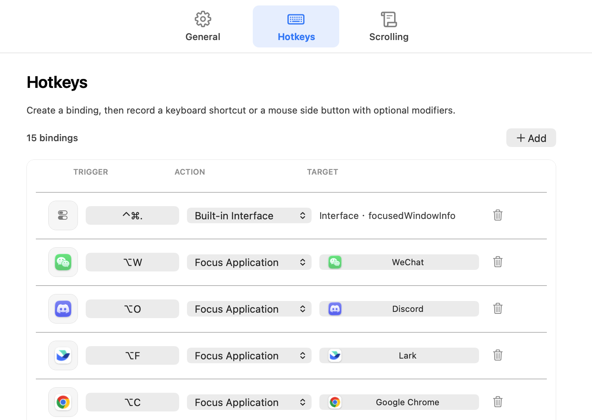
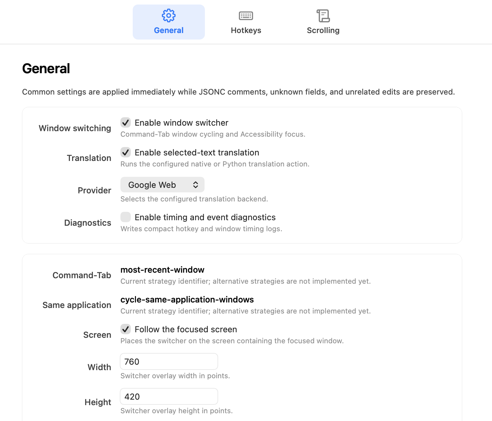
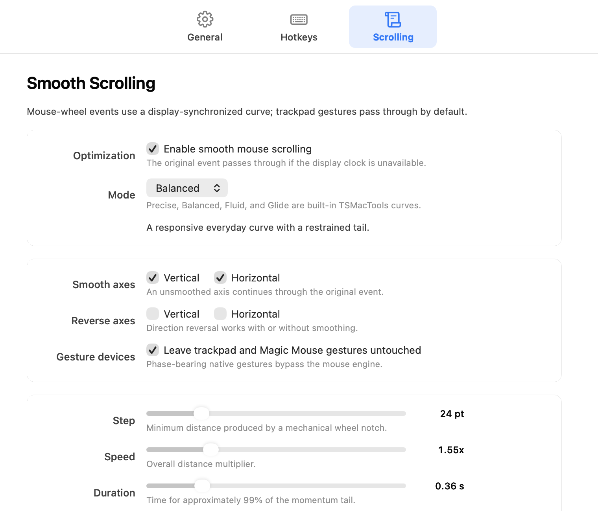

# TSMacTools

<p>
  <a href="https://github.com/Tsingv/TSMacTools/releases/latest"></a>
  
  
</p>

TSMacTools is a native, Swift-first macOS automation app inspired by Hammerspoon. It brings window switching, configurable keyboard and mouse hotkeys, display-synchronized smooth scrolling, script-driven native windows, and a Python automation boundary into one compact menu bar app.

Configuration lives in comment-friendly JSONC under `~/.config/tsmactool`; the Settings UI updates owned fields without discarding comments, unknown extension fields, or unrelated edits.

## Highlights

- **Action-based hotkeys:** bind keyboard combinations, mouse side buttons, or modifier-plus-mouse chords to focus an application, simulate a keystroke, call a built-in interface, or run a Python script.
- **Native window switching:** cycle real Accessibility windows across applications while retaining per-window focus behavior.
- **Smooth mouse scrolling:** choose local curves, tune both axes, reverse direction independently, and leave trackpad or Magic Mouse gestures untouched.
- **Script-driven native UI:** Python actions can show native plain-text, Markdown, or structured windows without embedding a browser-first runtime.
- **Safe live configuration:** compact AppKit settings preserve JSONC structure and apply most changes immediately.

## Settings at a glance

<p align="center">
  <picture>
    <source media="(prefers-color-scheme: dark)" srcset="docs/images/readme/settings-hotkeys-dark.png">
    <source media="(prefers-color-scheme: light)" srcset="docs/images/readme/settings-hotkeys-light.png">
    
  </picture>
</p>

<p align="center"><sub>Build bindings from independent trigger, action, and target controls. Application targets retain their installed icon and display name.</sub></p>

<table>
  <tr>
    <td width="50%"></td>
    <td width="50%"></td>
  </tr>
  <tr>
    <td align="center"><b>General</b><br><sub>Window switching, translation, scripting, and diagnostics.</sub></td>
    <td align="center"><b>Scrolling</b><br><sub>Presets, per-axis behavior, gesture bypass, and bounded tuning.</sub></td>
  </tr>
</table>

> [!NOTE]
> TSMacTools is under active development. Current release artifacts are development-signed and are not yet notarized for broad distribution.

## Quick Start

Download the current build from [GitHub Releases](https://github.com/Tsingv/TSMacTools/releases/latest), or build the app locally with Xcode.

### Build from source

Open the full Xcode project with:

```sh
open MacTools.xcodeproj
```

Build and test from the command line:

```sh
xcodebuild -project MacTools.xcodeproj -scheme MacTools -configuration Debug -derivedDataPath DerivedData build
xcodebuild -project MacTools.xcodeproj -scheme MacTools -configuration Debug -derivedDataPath DerivedData test
open DerivedData/Build/Products/Debug/TSMacTools.app
```

The repository ignores `DerivedData`, `DerivedDataCore`, `.build`, and `build` so local Xcode and compiler products do not appear as source changes.

Check whether the built app itself has Accessibility permission:

```sh
DerivedData/Build/Products/Debug/TSMacTools.app/Contents/MacOS/TSMacTools --check-accessibility
```

List the macOS 26 application controls that the built app can see in System Settings > Menu Bar:

```sh
DerivedData/Build/Products/Debug/TSMacTools.app/Contents/MacOS/TSMacTools --list-menu-bar-applications
```

On first launch, TSMacTools creates `~/.config/tsmactool/config.jsonc` and `~/.config/tsmactool/scripts`, then stays in the macOS menu bar without occupying Dock space. On macOS 26 and later, the status menu's **Menu Bar Icons** submenu mirrors System Settings > Menu Bar > Allow in the Menu Bar. It enumerates the real System Settings accessibility controls, shows each application's installed app icon and current allowed state, and presses the matching switch to show or hide its status item, preserving Control Center's live animation without restarting ControlCenter. Each row shows its app icon and name on the left, a checkmark on the right when enabled, and a spinner in place of the checkmark while a change is being applied. Rows use the same pointer-hover highlight treatment as normal menu items, and the submenu remains open while several applications are changed in succession. The app does not read or rewrite Control Center's privacy-protected group container. The action requires TSMacTools' existing Accessibility permission and may open the Menu Bar pane of System Settings in the background. The status menu can also reload configuration, open the configuration folder, and quit the app; Accessibility prompting happens automatically at startup when needed. `config.jsonc` is one normal JSON object with `//` and `/* */` comments allowed. The default config omits derived development-only fields such as `version`, hotkey `id`, `application.name`, and `application.configDirectoryName`.

Manual verification for menu bar visibility: on macOS 26 or later, open **Menu Bar Icons**, move the pointer across several rows and confirm that each receives the same hover highlight and foreground contrast as the main menu. Confirm that application icons match their installed apps and enabled rows have right-aligned checkmarks. Toggle two or more rows without reopening the submenu, confirm that each row shows a spinner while pending, and confirm that the submenu remains visible while each menu bar icon animates out or in without restarting ControlCenter. Reopen the submenu and System Settings > Menu Bar to confirm that both show the same state. Toggle the applications back to restore their original state.

The repository keeps a tracked example at `example_config/config.jsonc` plus `example_config/scripts`. Local development uses untracked `my_config`, and `~/.config/tsmactool` can be a symlink to that folder. Keep real API keys and personal edits in `my_config`; keep `example_config` complete, commented, and safe to commit.

Set `scripting.pythonPath` to the Python executable TSMacTools should use. The Hotkeys page owns the complete binding list: add or delete rows, choose an action, and select an application or Python file when that action needs a target. Adding a row scrolls it into view and immediately starts trigger recording. Focus-application rows display the selected bundle's current name and installed icon. A trigger can be a keyboard modifier combination, a mouse side button, or a modifier-plus-mouse chord such as `Command+Mouse 6`; the recorder preserves the held Command/Control/Option/Shift modifiers, and conflict/runtime matching uses the complete chord. `simulateKeystroke` can turn that trigger into another keyboard combination such as `Control+Down`. Simulated modifiers are attached to key-down and normally cleared on key-up; a typed key-semantics table also restores implicit flags carried by physical events, currently including the secondary-Function flag for arrow keys. This matches the flags stored by `AppleSymbolicHotKeys`, allowing Mission Control/App Exposé combinations to be recognized instead of reaching the frontmost app as an invalid command, and provides one extension point for other special keys. Command+Tab keeps Command on key-up as required by the app switcher. Keyboard recording temporarily installs a suppressing HID key-down tap, with session-level and local-monitor fallbacks, so modified arrow keys are captured before Mission Control or AppKit can execute them as navigation commands. Mouse buttons use zero-based Core Graphics numbering in JSONC (`3` and `4` are commonly the two side buttons) and run through a session-level event tap with HID fallback. When recording or configuration reload temporarily disables that tap, TSMacTools verifies its Mach port and enabled state before reuse and recreates it if it has died. Other actions can call built-in Swift interfaces or run user Python scripts. Use `{"kind":"callInterface","interfaceName":"reloadConfiguration"}` for app-provided behavior, `{"kind":"simulateKeystroke","modifiers":["ctrl"],"key":"Down"}` for synthesized input, or `{"kind":"runScript","path":"scripts/translate_selection.py","function":"main","input":"selectedText","nativeWindowID":"translate"}` to send selected text to a script function. The app loads config once, injects `config`, `input_text`, `nativewindow`, and `window` globals into the script module, then calls the configured function. Scripts do not read `~/.config/tsmactool/config.jsonc` themselves. While either trigger or simulated-keystroke recording is active, TSMacTools suspends its Carbon registrations and mouse-button event tap so the candidate cannot execute an existing action. A trigger already assigned to another row is rejected against the latest on-disk configuration, leaves the recorder active, and shows the conflicting action; Escape, focus loss, page changes, refresh, and window close restore the latest complete set.

The default config is a typed migration of the current Hammerspoon setup: app focus hotkeys, Finder/terminal toggles, command-tab style window switching preferences, and translation settings. The Finder toggle keeps the recent-window behavior when another app is frontmost; when Finder is already frontmost, it raises an existing Home folder window, or creates a new Home window if the current Finder window is already Home. Translation now supports `translation.provider`: `"google_web"` uses the unofficial `translate.googleapis.com/translate_a/single` endpoint with no API key, `"google"` uses Google Cloud Translation Basic v2 with `translation.googleApiKey`, and `"llm"` keeps the chat-completions-compatible path. Provider-owned endpoints and clients are built into the script defaults; config only needs them when intentionally overriding a provider. Google modes let Google detect the source language, translate Chinese text to `translation.googleTargetLanguageForChinese` (`en` by default), and translate other text to `translation.googleTargetLanguage` (`zh-CN` by default). `translation.normalizePDFLineBreaks` defaults to `true`, joining common PDF hard-wrapped lines before translation while preserving blank paragraphs and structural lines such as lists. `google_web` is convenient for local personal use but has no official stability, quota, or compatibility guarantees and may be rate-limited. The LLM path defaults to `qwen/qwen3.6-27b` with `translation.contextWindowTokens` set to `262144`, `translation.outputTokenLimit` set to `2048`, and `translation.requestTokenLimit` set to `8000` for Groq on-demand request budgeting. The LLM script sends the effective output budget as API `max_completion_tokens` and estimates prompt tokens before each request; if the selected text plus output budget exceeds the configured context window, the translation window shows a budget warning instead of sending the request. If the selected text plus output budget exceeds `requestTokenLimit`, the script clamps `max_completion_tokens` before sending so short translations do not fail with a service-tier TPM request-size error. HTTP error responses from providers are decoded and shown in the translation window instead of a generic status line. Set `translation.thinkingEnabled` to control model reasoning output and `translation.thinkingParameter` to choose how that preference is sent. The default `"include_reasoning"` works with the Groq-backed CLIProxyAPI path by sending `include_reasoning: false`, which hides reasoning from the returned content but may still consume reasoning tokens upstream. Use `"reasoning_format"` for Groq endpoints that prefer `reasoning_format: hidden`, `"enable_thinking"` for Qwen-compatible endpoints that accept that parameter, or `"none"` for strict endpoints that reject all extra fields. The translation script logs compact stderr summaries; the app includes them in `[hotkey]` logs when `windowSwitcher.debug` is enabled. The native translation window renders Markdown, keeps text selectable for copying, and folds returned `<think>...</think>` blocks behind a Show Thinking button. Short status messages such as reload success are shown in separate transient alert panels instead of reusing the script content window. The translation path now targets a floating `window.show` native window instead of Hammerspoon `hs.webview`; that window appears immediately with a spinning `Translating...` state while the script is running, follows light/dark mode, closes when it loses focus by default, and can be pinned from its title bar so later translations update the same long-lived window.

The window switcher is controlled by the `windowSwitcher` section in `~/.config/tsmactool/config.jsonc`. When enabled, TSMacTools installs a CGEvent tap for `Command+Tab` and `Command+\`` so it can cycle the selected Accessibility window in the background, delay the native window list briefly while Command is held, and focus the selected window when Command is released. The tap suppresses the handled tab/backtick key events, but lets modifier `flagsChanged` events continue through the system. Candidate windows are matched and de-duplicated by Accessibility window identity, with filtering based on CG/AX properties such as layer, alpha, role, subrole, and size. AX window lists are read once per process during each switch, using the normal short messaging timeout first and one bounded 300 ms retry after `kAXErrorCannotComplete`; if the list is still unavailable, the focused AX window is used as a last-resort candidate. This keeps temporarily busy applications such as Microsoft Excel from disappearing while still preventing a hung target app from stalling the switcher indefinitely. Finder/Dock application activation schedules bounded 50/180/450 ms captures that prefer the Office-style main window, discard stale captures after another activation, and fall back to the focused window. The app observer listens for both focused- and main-window changes, retries transient notification-registration failures, and treats permanently unsupported notifications as final. Candidate construction also promotes the current frontmost CG window so a missed AX event cannot leave stale recency ahead of the visible front window. AX lifecycle notifications remove destroyed windows from the recent list and keep hidden applications and minimized windows behind active windows. When `windowSwitcher.restorePreviousApplicationWhenNoWindows` is enabled (the default), they also restore the previous application only after repeated checks confirm that the frontmost app has no substantial Accessibility windows; the same behavior can be toggled from General settings. Failed AX reads are treated as indeterminate, and nonstandard main-window subroles still count as evidence that the app has a window. The restore path cancels if the frontmost app changes or macOS focuses another substantial window in the same app, preventing transient panels such as WeChat's emoji picker from switching to the previous application when they close. Focusing is AX-only: it clears the target window's minimized AX attribute, sets the system `kAXFocusedApplicationAttribute` and application `kAXFrontmostAttribute` for cross-app switches, performs `kAXRaiseAction` on the target window, sets the window's `kAXMainAttribute` and `kAXFocusedAttribute`, sets the owning application's `kAXFocusedWindowAttribute` to that same window, and verifies the result through an app-level AXObserver listening for `kAXFocusedWindowChangedNotification`. Finder still gets Hammerspoon's delayed AX main-window retry. The focus path avoids AppKit app-wide activation, Carbon front-process calls, synthetic mouse events, and pointer movement. Set `windowSwitcher.debug` to `true` to log CG/AX window attributes, lifecycle notifications, AX focus verification, focus retries, and timing lines such as `[window-switcher] buildChoices elapsed=...` and `[hotkey] runScript terminated elapsed=...`. For manual Excel verification, open several workbooks, launch or reactivate Word/Excel through Finder and the Dock, repeatedly switch away and back while Excel is recalculating or showing a sheet dialog, and confirm that the visible front Office window is first in recency and remains focusable; with debug logging enabled, a busy read should produce at most one `AX windows retry` line for Excel per switch operation.

After `Command+Tab` makes the window-switcher overlay visible, holding Shift while Command remains down moves the selection upward immediately and then repeats using AppKit's system key-repeat delay and interval, matching held-Tab downward speed. Shift does not move the selection before the overlay appears, and the selected window is still committed only when Command is released.

TSMacTools also checks Accessibility permission. If it is missing, the app requests the standard macOS prompt and does not open an extra permissions window. Grant access in System Settings > Privacy & Security > Accessibility, then restart the app.

Debug builds match this checkout's Xcode local-run identity: Automatically manage signing enabled, Team `426R374L39`, and Signing Certificate `Apple Development`. Build through the project without a command-line signing override; changing the team, certificate, bundle identifier, or app path can force macOS TCC to ask for Accessibility permission again. If `--check-accessibility` still prints `accessibility=missing` after granting access, remove the old TSMacTools entry from System Settings and add the current app at `DerivedData/Build/Products/Debug/TSMacTools.app`. Run the check from a normal terminal or Xcode launch context: macOS can attribute a helper process to its responsible parent application, so a check launched by another automation host is not definitive evidence about the already-running app process.

## Settings and smooth scrolling

Keyboard shortcuts are not limited to letters: one shared macOS virtual-key model supports the number row, punctuation such as `Command+[`, F1–F20, editing/navigation keys, the numeric keypad, and ISO/JIS keys. Captured key-down codes without a friendly name are preserved as `KeyCode:<number>`, so recording and execution cannot drift into separate key allowlists. Modifier-only keys remain modifiers, and Escape cancels recording.

Open **Settings...** from the status menu. The native settings window uses a compact top icon tab strip with **General**, **Hotkeys**, and **Scrolling** pages. It re-expresses the useful Mos preferences patterns in TSMacTools: centered compact toolbar items, cached page views instead of rebuilding them on every switch, a short eased crossfade, and an `NSTableView`-managed Hotkeys list with independent cells and aligned columns. The Hotkeys table is intentionally non-selecting, so scrolling cannot leave multiple rows painted blue. General shows the current reserved window-switcher strategy identifiers and exposes follow-screen placement, the empty-application fallback toggle, bounded dimensions/rows, Python path, Finder/terminal identifiers, ignored applications, translation languages, PDF normalization, copy delay, model/token budgets, and masked provider keys. Alternative switcher strategies are not implemented, so their identifiers are intentionally read-only instead of pretending a saved value changes behavior. Provider endpoints, prompts, native-window details, and hotkey action paths remain explicitly listed as advanced JSONC fields with a direct **Open config.jsonc...** action. Hotkeys records modifier-plus-key bindings and labels the shipped translation action by function; Scrolling applies changes immediately and writes them back to `config.jsonc`.

Settings reloads the latest file before every field-level mutation and uses coordinated, comment-preserving JSONC edits. Comments, field order, unknown extension fields, and unrelated text-editor changes survive a UI save; a repeatedly changing file is rejected instead of being overwritten. When a hotkey action changes kind, fields owned by the previous kind are written as `null` in place, which clears their typed values while preserving adjacent comments, ordering, and unknown action fields. The centered General, Hotkeys, and Scrolling tab content forwards icon and title hits to the full tab button. If another editor changes a visible field, the page reconciles after text editing, hotkey recording, mouse dragging, and pending slider saves are idle, while preserving its scroll position. Starting either trigger recorder now suspends the existing Carbon and mouse registrations before capture monitors are installed, preventing the candidate key from invoking an older binding. Changing a row's action cancels any active recorder before replacing that cell's target control. Keyboard hotkey triggers require at least one modifier; mouse-button triggers require Accessibility permission. Disabling selected-text translation blocks the typed action, native interface, and the shipped `scripts/translate_selection.py` hotkey path.

The `scroll` section optimizes mouse-wheel input with a display-synchronized curve. `precise`, `balanced`, `fluid`, and `glide` are local presets ordered from shorter, controlled movement to longer, faster movement; `custom` keeps the current tuning. These names describe TSMacTools behavior and do not claim Mos or Smooze Pro setting compatibility. The Scrolling page exposes step, speed, duration, acceleration, and stop threshold, plus independent smoothing and direction reversal for vertical and horizontal axes. With `excludeTrackpad: true` (the default), phase- or scroll-count-bearing trackpad and Magic Mouse gestures stay on the native system path. Logitech Options wheel events are classified by source so its nonzero scroll count is not mistaken for a trackpad, while already-continuous remote-desktop events bypass local smoothing. The TSMacTools-owned classifier matches normalized bundle/executable identity fragments, supports application variants, and drops its one-process cache when that application terminates so PID reuse cannot inherit stale behavior. Other third-party drivers remain part of the hardware verification checklist.

The runtime keeps its window-switcher, global-hotkey, and smooth-scroll controllers across configuration reloads. Only a changed hotkey array is re-registered; an enabled window-switcher updates its typed configuration without rebuilding the CGEvent tap; scroll tuning reuses its event-tap and display-driver objects. The App delegate explicitly shuts down the main-actor Carbon hotkey handler before termination instead of deferring Carbon cleanup to Swift's nonisolated deinitializer. `MacToolsCore` owns the allocation-free engine, complete tracking/momentum phase state machine, and generation/TTL/PID session, while the `MacToolsMacOS` static library owns injected event-tap, display-clock, scheduling, permission, source-classification, and posting adapters. Mechanical line-unit input is normalized once per physical event to a reusable pixel-unit synthetic template; its original line distance is accumulated and emitted on only the next synthetic frame, preventing both point-only zero output and one-line-per-animation-frame amplification. CoreVideo output callbacks only record current-run readiness and coalesce timestamps onto a serial delivery queue; they never enter controller code synchronously, so `CVDisplayLinkStop` cannot deadlock with the controller operation lock during mouse-down cancellation, idle stop, reload, or teardown. Run generations discard queued callbacks across stop/restart boundaries. Controller frame delivery remains serialized, a session generation guard plus copied-event TTL rejects old tails, terminal sessions clear their target PID, and a mouse click cancels pending motion. Screen changes coalesce only while enabled. Shutdown and background deinitialization cancel tasks, remove the observer/run-loop source, disable the tap, invalidate late callbacks through weak token registries, and release display resources. If a display link cannot be prepared, started, or has not yet delivered its first real callback for the current display-link run, the raw non-smoothed event remains on the system path, with field-wise direction reversal still applied. Idle stop clears this run readiness while retaining the prepared display-link handle, so a callback from an earlier run can never authorize consuming input after a stalled restart. Event-tap recovery rechecks Accessibility and is limited to three attempts per minute.

On macOS 26, marked synthetic scroll frames are posted through the session event tap using the copied physical pointer location, because direct-to-PID wheel delivery is ignored by representative targets such as WeChat. Older systems retain target-PID delivery. The synthetic marker prevents the session-routed frames from re-entering smoothing. Debug builds retain only bounded `[smooth-scroll]` samples for physical-event disposition and frame routing so device regressions can be diagnosed without unbounded hot-path logging.

The implementation was informed by the read-only `references/Mos` checkout, but is a typed Swift implementation rather than reused Mos runtime code. The evidence matrix is in [`docs/parity/mos-scroll.md`](docs/parity/mos-scroll.md). Automated tests cover exact phase order and momentum interruption, line-unit wheel normalization and whole-gesture distance conservation, single-template frame reuse, current-run readiness reset across idle stop/start, display prepare/start/first-callback/unavailable fallback, nonblocking live display stop while controller frame work is stalled, permission recovery throttling, screen-change debounce and disabled suppression, concurrent/late callbacks, background teardown, PID switching and idle-route clearing, TTL expiry, mixed-axis field preservation, synthetic recursion prevention, remote/Logitech classification, legacy Dock bypass policy, and mouse-click cancellation. Real Accessibility revocation, physical detented/high-resolution mice, third-party drivers, display hot-plugging, and Instruments handle/latency measurements remain release-device checks.

After changing Mos-informed settings or scrolling code, run `~/.venv/bin/python Tools/check_mos_provenance.py`. This narrow guard rejects exact normalized blocks of four or more consecutive source lines shared with `references/Mos`; it supports the independent-implementation review but is not a general similarity detector or legal analysis.

Debug builds can render the real settings pages in both appearances, plus compact 760 x 540 Hotkeys and Scrolling variants, without Screen Recording permission:

```sh
DerivedData/Build/Products/Debug/TSMacTools.app/Contents/MacOS/TSMacTools --render-settings-previews DerivedData/SettingsPreviews
```

## Development Rule

When code changes, update both `AGENTS.md` and `README.md` in the same commit. This includes changes to architecture, build settings, permissions, scripting commands, tests, and runtime behavior. If the change affects config fields, script entrypoints, or user-facing automation behavior, update the tracked `example_config` template in the same commit.

Architecture notes and migration rules live in `AGENTS.md`. The local read-only reference checkouts are in `references/hammerspoon` and `references/Mos`.
